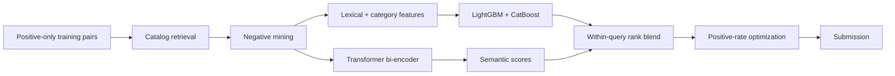

<div align="center">

# 🛒 Trendyol E-Commerce Relevance

### TEKNOFEST 2026 E-Commerce Product–Search Matching

[](https://www.python.org/)
[](https://www.kaggle.com/competitions/trendyol-e-ticaret-yarismasi-2026-kaggle)
[](notebooks/)
[](https://github.com/z3lka/tr_e_tic_hack/actions/workflows/ci.yml)

An end-to-end retrieval and ranking project for matching Turkish e-commerce
search terms with relevant products.

The solution combines lexical matching, category-aware gradient boosting,
positive-unlabeled learning, and transformer bi-encoders.

[Explore the notebooks](notebooks/) · [Competition page](https://www.kaggle.com/competitions/trendyol-e-ticaret-yarismasi-2026-kaggle) · [Read the experiment notes](docs/project_notes.md)

</div>

---

## Project snapshot

| Item | Details |
|---|---|
| Task | Binary product–search relevance classification and ranking |
| Training data | 250,000 positive product–term pairs |
| Product catalog | 966,444 items |
| Test candidates | 3,359,679 product–term pairs |
| Metric | Macro-F1 |
| Validation | Leakage-aware, term-grouped 5-fold validation |
| Models | Lexical scoring, LightGBM, CatBoost, and transformer bi-encoders |
| Best recorded score | **0.870 Macro-F1** |
| Final standing | **116th of 377 participants — top 30.8%** |

> **The central challenge:** the training set contains positive matches but no
> explicit negative labels. A competitive solution therefore needs to create
> useful negative examples without leaking information from the test candidates.

## Results

The project evolved from hand-built lexical features to a mixture-of-experts
rank blend:

| Approach | Positive rate | Public Macro-F1 |
|---|---:|---:|
| Lexical baseline | 20.3% | 0.760 |
| Positive-unlabeled LightGBM | 20.0% | 0.780 |
| GBDT + transformer rank blend | 22.0% | 0.854 |
| GBDT + transformer rank blend | 24.0% | 0.867 |
| GBDT + transformer rank blend | 26.0% | **0.870** |

The final blend improved the strongest earlier tree-based result by nine
Macro-F1 points.

## What made the approach work

- **Deterministic negative mining** creates uniform, hard, and semi-hard
  negatives from the product catalog instead of treating test pairs as labels.
- **Turkish-aware lexical features** capture token overlap, lightweight stemming,
  fuzzy similarity, brand, category, color, gender, age-group, and attribute
  signals.
- **Category priors** learn which product categories are plausible for each
  query without using held-out labels.
- **Gradient-boosted rerankers** combine lexical and category evidence using
  LightGBM and CatBoost.
- **Transformer bi-encoders** add semantic similarity that lexical models miss.
- **Within-query rank blending** puts scores from different model families onto
  a comparable scale.
- **Term-grouped validation** keeps every search term in exactly one fold,
  providing a more realistic estimate for unseen queries.

## Repository structure

```text
.
├── README.md
├── requirements.txt
├── src/                         # training, retrieval, and scoring modules
├── tests/                       # unit and synthetic end-to-end tests
├── notebooks/                   # Kaggle workflows and experiment baselines
├── scripts/                     # reproducible notebook generators
├── docs/                        # methodology and experiment history
├── data/                        # competition files; local only
└── outputs/                     # models, scores, and submissions; local only
```

Competition data, model checkpoints, embedding caches, training logs, and
submission files are intentionally excluded from version control.

## Run locally

1. Clone the repository and create an environment:

   ```bash
   git clone git@github.com:z3lka/tr_e_tic_hack.git
   cd tr_e_tic_hack

   python -m venv .venv
   source .venv/bin/activate
   python -m pip install --upgrade pip
   python -m pip install -r requirements-dev.txt
   ```

2. Download the competition data with the
   [Kaggle CLI](https://github.com/Kaggle/kaggle-api):

   ```bash
   kaggle competitions download \
     -c trendyol-e-ticaret-yarismasi-2026-kaggle \
     -p data
   unzip data/trendyol-e-ticaret-yarismasi-2026-kaggle.zip -d data
   ```

3. Confirm that the expected files are present:

   ```text
   data/
   ├── items.csv
   ├── sample_submission.csv
   ├── submission_pairs.csv
   ├── terms.csv
   └── training_pairs.csv
   ```

4. Run the test suite:

   ```bash
   python -m pytest
   ```

Transformer experiments require the optional PyTorch and Hugging Face stack:

```bash
python -m pip install -r requirements-transformer.txt
```

## Modeling workflow



## Try the main workflows

Build lexical scores:

```bash
PYTHONPATH=src python src/lexical_baseline.py score \
  --data-dir data \
  --output outputs/lexical_scores.csv
```

Build leakage-aware grouped validation slates:

```bash
PYTHONPATH=src python src/grouped_oof_validation.py build-slates \
  --data-dir data \
  --output-dir outputs/grouped_oof \
  --n-splits 5
```

Regenerate the self-contained Kaggle notebooks from the current source:

```bash
python scripts/build_grouped_oof_kaggle_notebook.py
python scripts/build_fast_hybrid_embedding_notebook.py
```

For the complete workflows, see:

- [Term-grouped 5-fold validation](docs/grouped_oof_validation.md)
- [Fast hybrid embedding retrieval](docs/fast_hybrid_embedding_retrieval.md)
- [Experiment history and leaderboard notes](docs/project_notes.md)

## Lessons learned

- Positive-only data turns negative sampling into a core modeling decision, not
  a preprocessing detail.
- Candidate retrieval recall sets the ceiling for every downstream reranker.
- Grouping validation by search term is essential when inference contains unseen
  queries.
- Semantic and lexical models make different errors, which makes rank blending
  more valuable than simply choosing the strongest individual model.
- Macro-F1 is highly sensitive to the positive decision rate; threshold and rate
  tuning deserve the same discipline as model tuning.
